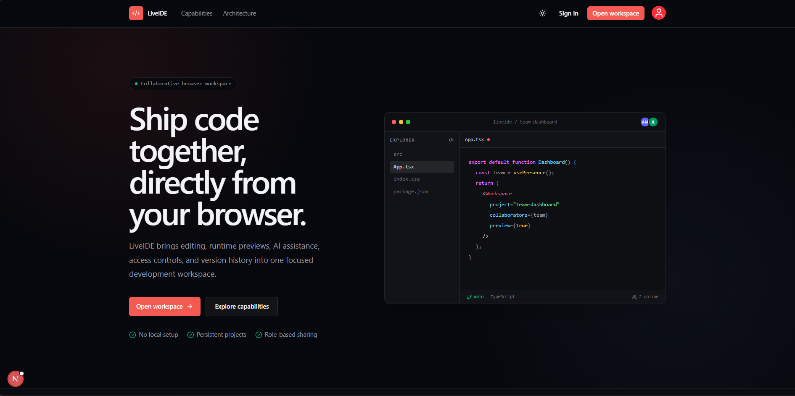
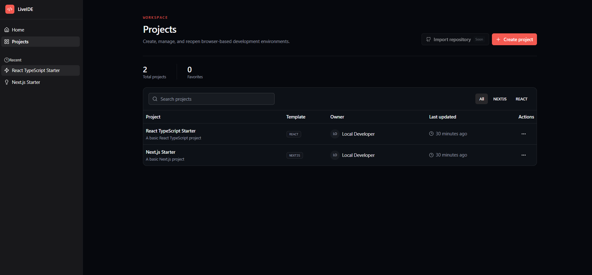
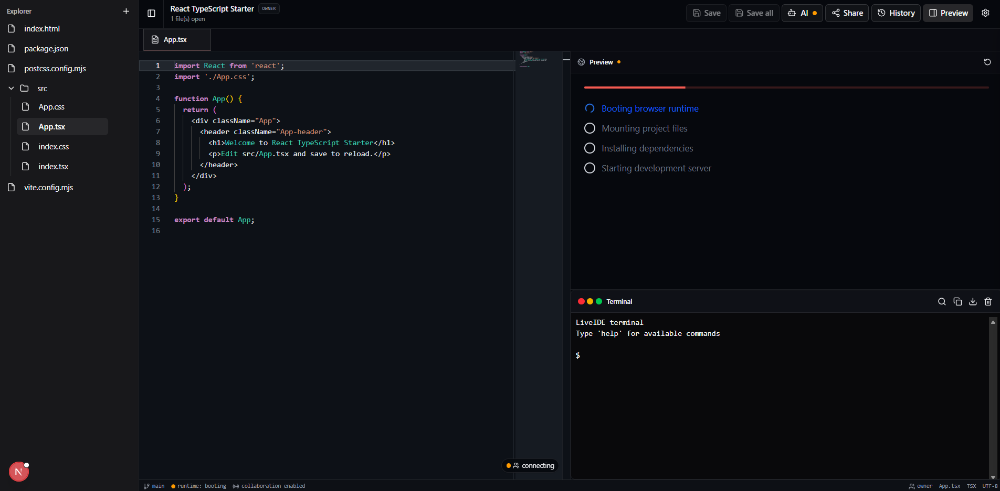
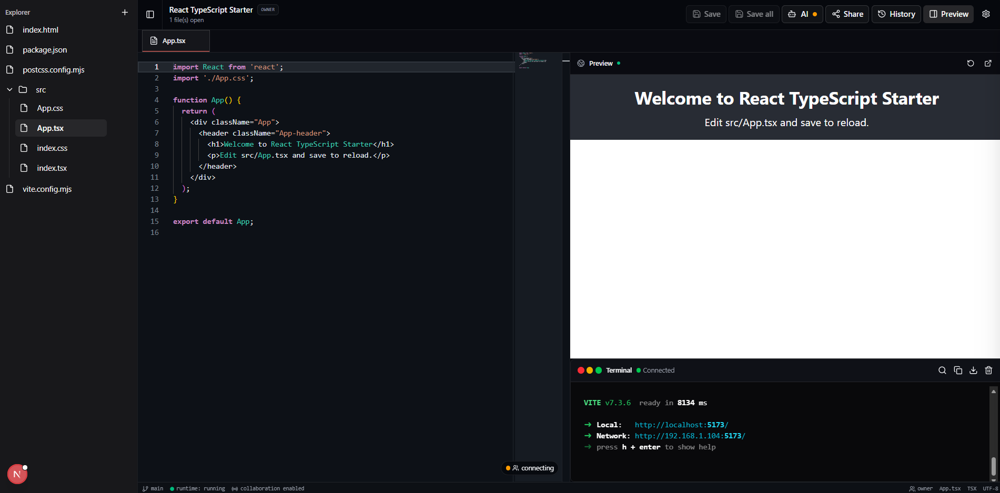

# LiveIDE

LiveIDE is a collaborative browser-based development workspace for creating, running, previewing, and sharing web projects. It combines a Monaco editor, WebContainer runtime, real-time CRDT collaboration, project history, role-based access, and optional AI assistance in one application.

## Product preview

<details>
<summary><strong>View application screenshots</strong></summary>

<br />

<table>
  <tr>
    <td width="50%" align="center">
      <strong>Landing page</strong><br /><br />
      
    </td>
    <td width="50%" align="center">
      <strong>Project dashboard</strong><br /><br />
      
    </td>
  </tr>
  <tr>
    <td width="50%" align="center">
      <strong>Runtime startup</strong><br /><br />
      
    </td>
    <td width="50%" align="center">
      <strong>Live preview and terminal</strong><br /><br />
      
    </td>
  </tr>
</table>

</details>

## Core capabilities

- Multi-file editing with Monaco Editor
- Browser-based Node.js execution with WebContainers
- Live application preview and integrated xterm.js terminal
- React and Next.js starter projects
- Persistent projects backed by Prisma and MongoDB
- Owner, editor, and viewer access roles
- Yjs CRDT collaboration with live participant presence
- Optional Redis relay for multi-instance collaboration
- Named snapshots, restore history, and audit events
- Optional provider-backed AI chat and manual inline completion
- Authentication through Auth.js, with an explicit local guest mode for development

AI is deliberately non-blocking. It is disabled until a provider is configured, inline completion runs only on `Ctrl+Space`, `Tab` accepts only a visible completion, and ordinary editing, saving, and preview rendering do not invoke AI.

## Technology

| Area | Stack |
| --- | --- |
| Application | Next.js 16, React 19, TypeScript |
| Interface | Tailwind CSS 4, Radix UI, shadcn/ui |
| Editor | Monaco Editor |
| Runtime | WebContainers, xterm.js |
| Data | Prisma, MongoDB |
| Authentication | Auth.js / NextAuth 5 |
| Collaboration | Yjs, y-websocket, y-monaco, optional Redis |
| Validation and tests | Zod, Vitest, Testing Library, Playwright |

## Architecture

```text
app/                         Next.js routes, layouts, API handlers
components/                  Shared interface components
features/
  ai-chat/                   AI client, provider, validation, persistence
  auth/                      Authentication interface and flows
  dashboard/                 Project dashboard
  playground/                Editor, file tree, sharing, history
  webcontainers/             Runtime lifecycle, preview, terminal
prisma/                      Database schema
scripts/                     Collaboration and migration utilities
starter-templates/           Browser-runtime project templates
tests/                       Unit and integration tests
e2e/                         Playwright scenarios
```

## Local setup

### Requirements

- Node.js 20 or newer
- npm
- MongoDB, unless using the development-only mock database
- Ollama or another supported AI provider only if AI features are required

### Install

```bash
git clone https://github.com/kunalpehere/LiveIDE.git
cd LiveIDE
npm install
copy .env.example .env.local
```

Set a strong `AUTH_SECRET` and configure the database in `.env.local`. For local interface testing without OAuth, use the project's documented development guest-auth setting. Never enable guest or mock modes in production.

Apply the Prisma schema:

```bash
npm run prisma:generate
npm run db:push
```

Run the application:

```bash
npm run dev
```

Run the application and collaboration service together:

```bash
npm run dev:collaboration
```

Open [http://localhost:3000](http://localhost:3000).

## Optional AI configuration

AI remains disabled unless explicitly enabled. A local Ollama configuration looks like this:

```env
AI_ENABLED="true"
AI_PROVIDER="ollama"
AI_PROVIDER_URL="http://localhost:11434"
AI_MODEL="codellama:latest"
AI_TIMEOUT_MS="20000"
```

Start the provider before enabling AI. If it is not configured or cannot be reached, LiveIDE continues to operate as a normal browser IDE and reports the provider status in the AI menu.

## Collaboration

Configure `NEXT_PUBLIC_COLLABORATION_URL` and use `npm run dev:collaboration`. Invite another account as an editor from the Share dialog. When both users open the same file, Yjs synchronizes edits and cursor presence.

Collaboration snapshots are persisted to MongoDB. For horizontally scaled deployments, configure `REDIS_URL`; see [collaboration scaling](docs/collaboration-scaling.md).

## Quality checks

```bash
npm run lint
npm run typecheck
npm test
npm run test:e2e
npm run build
```

The current automated suite covers authorization, file-tree operations, database configuration, AI validation and provider behavior, error contracts, collaboration permissions and persistence, project history, and WebContainer session management.

## Security notes

- Keep `.env.local`, provider credentials, database URLs, and authentication secrets out of Git.
- Disable development guest authentication and the mock database in production.
- Use a private collaboration secret shared only by the application and collaboration service.
- Configure production rate limits, trusted origins, and deployment-specific provider timeouts.

## Roadmap

- Git repository import and export
- Managed deployment workflows
- Additional AI providers
- Expanded end-to-end collaboration coverage
- Project-level release and snapshot comparisons

## Author

Kunal Pehere — [GitHub](https://github.com/kunalpehere)
