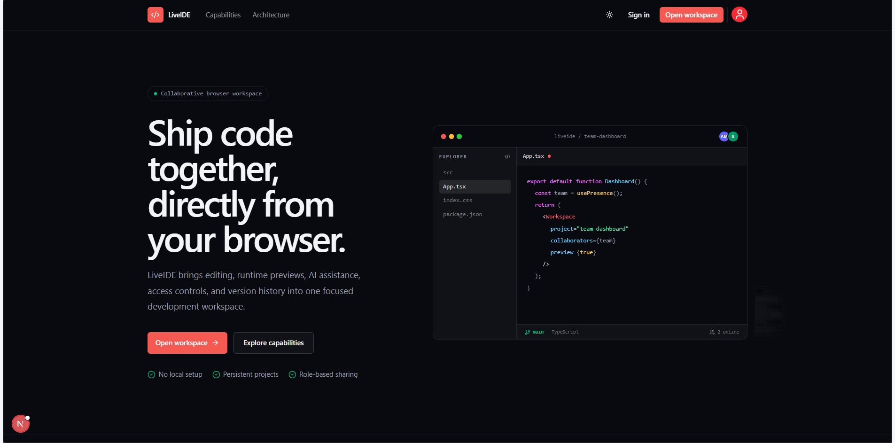

# LiveIDE — Collaborative Development Workspace

**Code, run, preview, and collaborate on web projects in your browser.**

LiveIDE is a collaborative browser-based development workspace for creating, running, previewing, and sharing web projects. It combines a Monaco editor, WebContainer runtime, real-time CRDT collaboration, project history, role-based access, and optional AI assistance in one application.

## Deployment status

[Vercel preview](https://liveide-preview-kunal-pehere.vercel.app) · [Deployment guide](docs/vercel-deployment.md)

This is a development preview with Vercel access protection, not a public production release. Preview builds, MongoDB readiness, security headers, and GitHub provider configuration have been verified; the owner has reported successful GitHub sign-in. Visitors may need Vercel access before reaching LiveIDE's sign-in page. Database network access was enabled temporarily for testing and must remain valid for the preview to work.

Implementation is complete through roadmap Day 27; Day 28 deployment verification is in progress. The separate collaboration service is not deployed yet (Day 29), so real-time collaboration is disabled on this preview. AI is also disabled. Browser runtime checks, authenticated persistence checks, production configuration, and the final beta release gate remain pending.

## Product preview



> The looping preview cycles through the landing page, project dashboard, editor startup, and running preview states so the README behaves like a lightweight screenshot carousel.

## Core capabilities

- Multi-file editing with Monaco Editor
- Browser-based Node.js execution with WebContainers
- Live application preview and integrated xterm.js terminal
- React and Next.js starter projects
- Persistent projects backed by Prisma and MongoDB
- Owner, editor, and viewer access roles
- Yjs CRDT collaboration with live participant presence
- Opt-in collaborator following across files, selections, and scroll
- Optional Redis relay for multi-instance collaboration
- Named snapshots, restore history, and audit events
- Optional provider-backed AI chat and manual inline completion
- Authentication through Auth.js, with an explicit local guest mode for development

AI is deliberately non-blocking. It is disabled until a provider is configured, inline completion runs only on `Ctrl+Space`, `Tab` accepts only a visible completion, and ordinary editing, saving, and preview rendering do not invoke AI.

## Technology

| Area | Stack |
| --- | --- |
| Application | Next.js 16, React 19, TypeScript |
| Interface | Tailwind CSS 4, Radix UI, shadcn/ui |
| Editor | Monaco Editor |
| Runtime | WebContainers, xterm.js |
| Data | Prisma, MongoDB |
| Authentication | Auth.js / NextAuth 5 |
| Collaboration | Yjs, y-websocket, y-monaco, optional Redis |
| Validation and tests | Zod, Vitest, Testing Library, Playwright |

## Architecture

The detailed product rationale, system boundaries, flows, and delivery plan are documented here:

- [Project foundation and interview guide](docs/project-foundation.md)
- [System architecture and flows](docs/architecture.md)
- [Daily development roadmap](docs/development-roadmap.md)
- [Collaboration scaling](docs/collaboration-scaling.md)
- [Editor render boundaries and profiling](docs/editor-render-boundaries.md)
- [Runtime lifecycle, cancellation, and recovery](docs/runtime-lifecycle.md)
- [Dependency reuse and startup measurements](docs/runtime-startup.md)
- [Terminal output limits and preview recovery](docs/runtime-resilience.md)
- [Collaborator follow mode and verification](docs/collaborator-follow.md)
- [Invitation lifecycle and verification](docs/invitation-lifecycle.md)
- [Collaborative project notes and verification](docs/collaborative-notes.md)
- [Shared runtime status, controls, and verification](docs/shared-runtime.md)
- [GitHub connection security and setup](docs/github-connection.md)
- [GitHub repository browser and file restrictions](docs/github-repository-browser.md)
- [GitHub repository import, source metadata, and limits](docs/github-repository-import.md)
- [GitHub change review, commit consent, and recovery](docs/github-review-and-commit.md)
- [Resource limits and remediation](docs/resource-limits.md)
- [Storage measurements and bounded beta decision](docs/storage-evaluation.md)
- [Immutable snapshots, retention, and restore audit](docs/immutable-history.md)
- [Verified MongoDB backup and recovery runbook](docs/database-recovery.md)
- [Vercel preview setup and deployment evidence](docs/vercel-deployment.md)

```text
app/                         Next.js routes, layouts, API handlers
components/                  Shared interface components
features/
  ai-chat/                   AI client, provider, validation, persistence
  auth/                      Authentication interface and flows
  dashboard/                 Project dashboard
  playground/                Editor, file tree, sharing, history
  webcontainers/             Runtime lifecycle, preview, terminal
prisma/                      Database schema
scripts/                     Collaboration and migration utilities
starter-templates/           Browser-runtime project templates
tests/                       Unit and integration tests
e2e/                         Playwright scenarios
```

## Local setup

### Requirements

- Node.js 22 (see `.nvmrc` for the CI version)
- npm
- MongoDB, unless using the development-only mock database
- Ollama or another supported AI provider only if AI features are required

### Install

```bash
git clone https://github.com/kunalpehere/LiveIDE.git
cd LiveIDE
npm ci
npm run prisma:generate
copy .env.example .env.local
```

Set a strong `AUTH_SECRET` and configure the database in `.env.local`. For local interface testing without OAuth, use the project's documented development guest-auth setting. Never enable guest or mock modes in production.

See [runtime configuration](docs/configuration.md) for validated settings, independent collaboration secrets, and production requirements.

See [browser security](docs/browser-security.md) for isolation headers, CSP, browser runtime requirements, and deployment checks.

See [observability and health](docs/observability.md) for request IDs, safe error reporting, dependency readiness, and operational checks.

See [collaboration protocol](docs/collaboration-protocol.md) for versioned messages, room identity, error behavior, and coordinated rollout.
See [differential synchronization](docs/differential-synchronization.md) for state-vector recovery, update origins, and measured incremental payloads.
See [collaboration recovery](docs/collaboration-recovery.md) for connection states, retry limits, offline editing, and restart checks.
See [presence event control](docs/collaboration-presence.md) for cursor traffic limits, stale-participant cleanup, and the persistence boundary.
See [collaboration authorization](docs/collaboration-authorization.md) for scoped roles, active access checks, token renewal, and restore protection.
See [collaboration performance](docs/collaboration-performance.md) for 2/5/10-client correctness scenarios, measured timings, and development diagnostics.

Apply the Prisma schema:

```bash
npm run prisma:generate
npm run db:push
```

Run the application:

```bash
npm run dev
```

Run the application and collaboration service together:

```bash
npm run dev:collaboration
```

Open [http://localhost:3000](http://localhost:3000).

## Optional AI configuration

AI remains disabled unless explicitly enabled. A local Ollama configuration looks like this:

```env
AI_ENABLED="true"
AI_PROVIDER="ollama"
AI_PROVIDER_URL="http://localhost:11434"
AI_MODEL="codellama:latest"
AI_TIMEOUT_MS="20000"
```

Start the provider before enabling AI. If it is not configured or cannot be reached, LiveIDE continues to operate as a normal browser IDE and reports the provider status in the AI menu.

## Collaboration

Configure `NEXT_PUBLIC_COLLABORATION_URL` and use `npm run dev:collaboration`. Invite another account as an editor from the Share dialog. When both users open the same file, Yjs synchronizes edits and cursor presence.

Collaboration snapshots are persisted to MongoDB. For horizontally scaled deployments, configure `REDIS_URL`; see [collaboration scaling](docs/collaboration-scaling.md).

## Quality checks

For the complete fresh-checkout procedure and CI debugging, see the [quality pipeline guide](docs/quality-pipeline.md).

```bash
npm ci
npm run prisma:generate
npm run lint
npm run typecheck
npm test
npm run build
npm run test:e2e
```

The automated suite covers authorization, file-tree operations, resource limits, database configuration, AI validation and provider behavior, error contracts, collaboration permissions and persistence, immutable project history, and WebContainer session management. Additional reproducible checks are available:

```bash
npm run verify:storage
npm run verify:recovery
```

The recovery drill requires MongoDB Server and MongoDB Database Tools and runs against isolated disposable databases. See the [recovery runbook](docs/database-recovery.md) for requirements and the limits of the measured results.

## Security notes

- Keep `.env.local`, provider credentials, database URLs, and authentication secrets out of Git.
- Disable development guest authentication and the mock database in production.
- Use a private collaboration secret shared only by the application and collaboration service.
- Configure production rate limits, trusted origins, and deployment-specific provider timeouts.

## Roadmap

Development is organized into verifiable daily milestones rather than a feature wish list. See the [daily development roadmap](docs/development-roadmap.md) for the planned sequence, acceptance checks, and suggested commit boundaries.

## Author

Kunal Pehere — [GitHub](https://github.com/kunalpehere)
