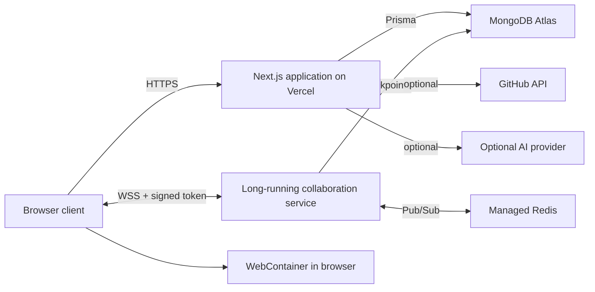
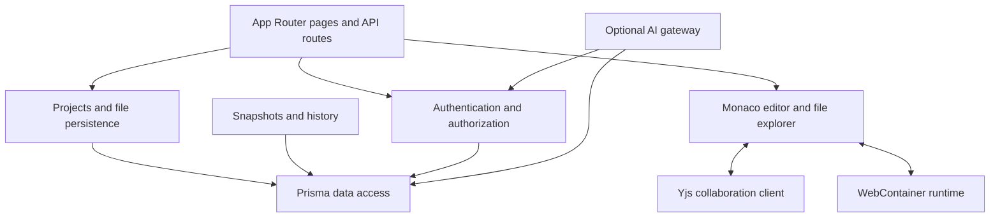
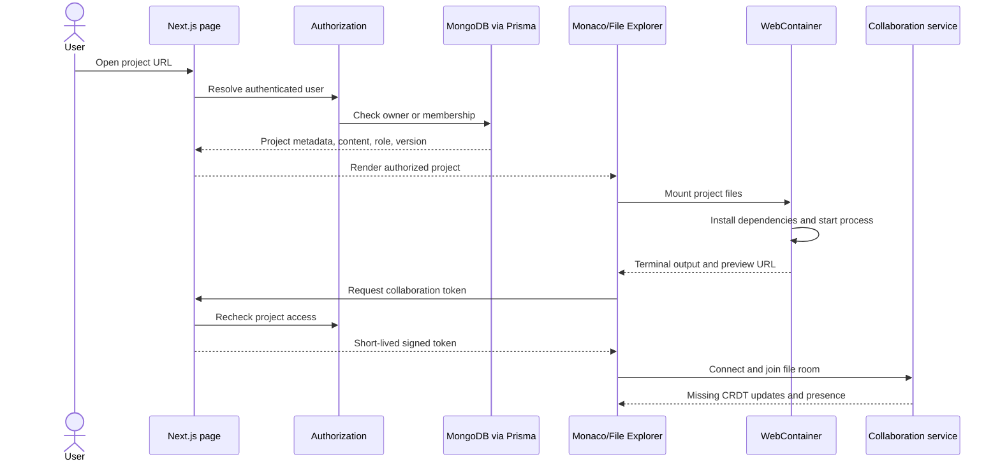
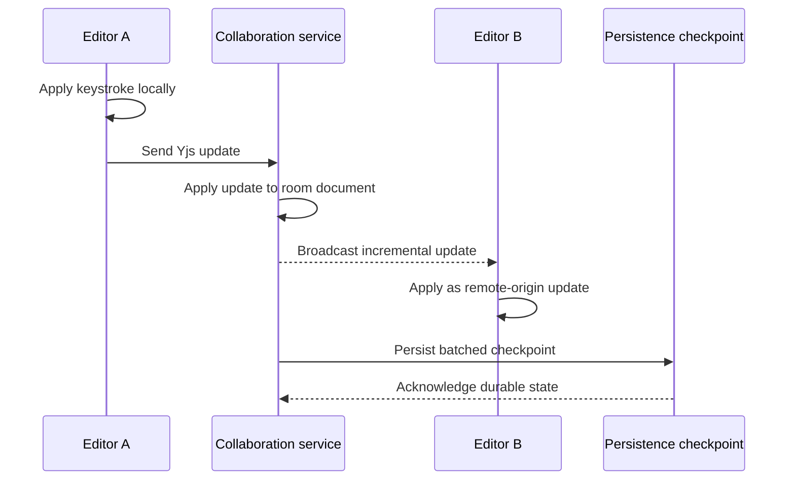
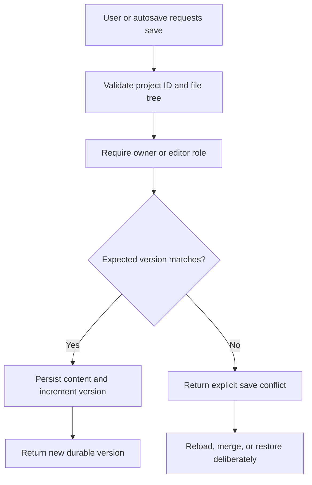
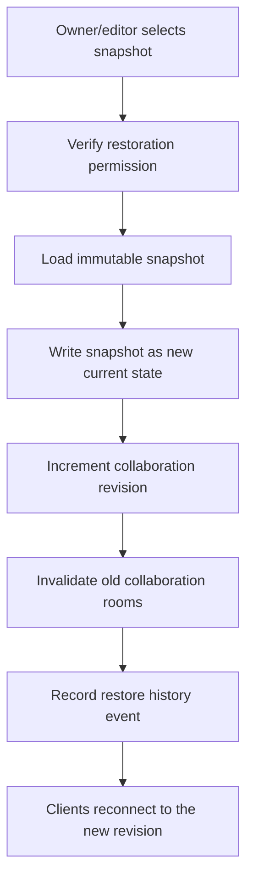
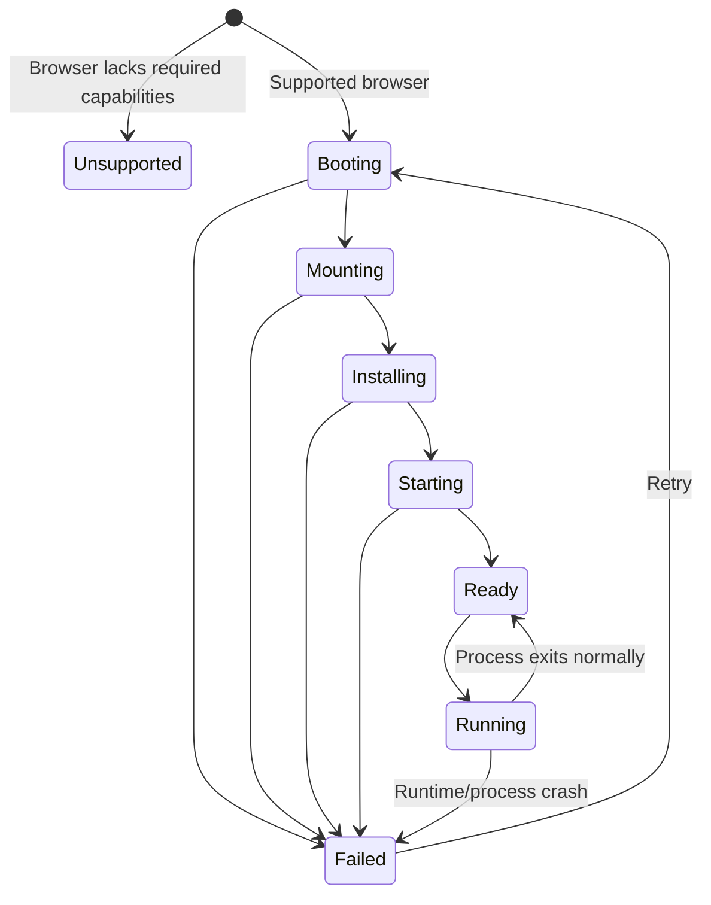
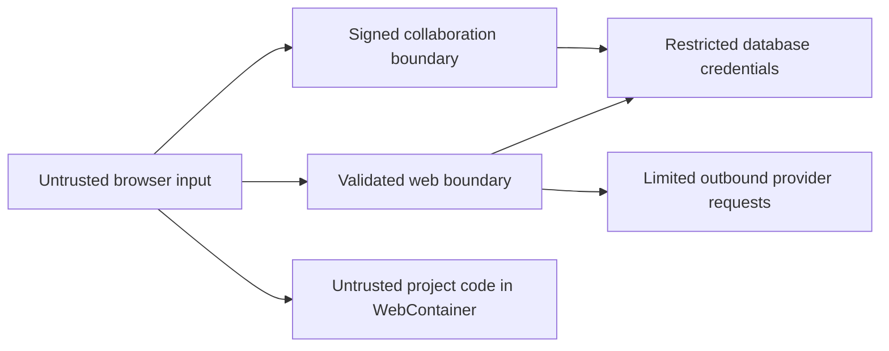

# LiveIDE system architecture

## Architecture goals

The architecture separates four kinds of state that have different consistency and lifecycle requirements:

1. **Product state:** users, projects, membership, snapshots, and history.
2. **Editor state:** open files, selections, models, unsaved local changes, and layout.
3. **Collaboration state:** CRDT updates, presence, cursors, and active-file awareness.
4. **Runtime state:** mounted files, processes, terminal streams, preview URLs, and failures.

Keeping these boundaries explicit is the central architectural rule of LiveIDE.

## Production topology

The collaboration process must not be deployed as a normal Vercel Function. It requires a host that supports long-lived WebSocket connections. Redis is optional for a single instance and required when multiple collaboration instances serve active rooms.

## Application modules

## Project opening flow

Authorization is checked before project data is returned and again before realtime access is granted. Proxy or page redirects alone are not security boundaries.

## Collaborative editing flow

Typing must never wait for the database. Persistence is batched and recoverable. Remote updates must be tagged so they are not emitted again as new local operations.

## Save and conflict flow

The version check prevents a stale browser session from silently replacing newer durable content.

## Snapshot restoration flow

Restoration creates new history; it does not erase the intervening history. Revisioning prevents clients attached to an older collaborative room from overwriting the restored state.

## Runtime flow

The UI should expose these states rather than showing an indefinite generic loader. A runtime failure must not destroy editor state.

## Deployment responsibilities

| Component | Responsibility | Suitable host |
| --- | --- | --- |
| Next.js application | Pages, API routes, server actions, authentication, authorization | Vercel |
| Collaboration service | WebSockets, Yjs rooms, presence, checkpoint coordination | Render, Railway, Fly.io, Cloud Run, or equivalent |
| MongoDB | Durable product and collaboration state | MongoDB Atlas |
| Redis | Cross-instance realtime relay and distributed limits | Managed Redis |
| WebContainer | User project execution | Supported browser |
| AI provider | Optional chat and completion generation | External provider or separately hosted service |

## Trust boundaries

- Browser-provided roles, user IDs, project IDs, filenames, and file contents require validation.
- Collaboration tokens should be short-lived and scoped to one project revision/room and role.
- Development guest authentication and mock data must fail closed in production.
- Project code must not execute inside the Next.js or collaboration processes.
- Secrets must never be copied into the WebContainer filesystem or AI prompt context.

## Performance strategy

### Editor

- Keep Monaco models stable when panels open or close.
- Avoid storing every keystroke in broad React state.
- Use refs or external services for high-frequency editor and runtime objects.
- Lazy-load Monaco and optional secondary panels.

### Collaboration

- Transfer incremental Yjs updates rather than whole documents.
- Throttle cursors, selections, pointers, and scroll state independently.
- Batch durable checkpoints.
- Reconnect with backoff and state-vector resynchronization.

### Runtime

- Reuse a WebContainer session for the active project.
- Avoid reinstalling unchanged dependencies.
- Bound terminal output retained in memory.
- Keep preview and terminal failures isolated from editing.

### Data

- Query only the fields required by each view.
- Paginate growing project, history, member, and chat collections.
- Establish project size, file count, snapshot count, and message limits.
- Measure queries before adding caches.

## Availability and graceful degradation

| Failure | Expected behavior |
| --- | --- |
| AI provider unavailable | Editing, collaboration, saving, and runtime continue |
| Redis unavailable in a single-instance environment | Collaboration continues in documented single-instance mode |
| Redis unavailable in distributed production | Readiness should fail or traffic should be restricted to prevent split rooms |
| Collaboration connection lost | Local edits remain available and client reconnects/resynchronizes |
| WebContainer fails | Editor and durable project remain usable; retry is offered |
| Database unavailable | Destructive or durable operations fail safely; no false success is shown |

## Architecture evolution rule

LiveIDE should remain a modular application plus one dedicated realtime service until measured load or ownership boundaries justify additional services. GitHub integration, remote execution, and AI may use separate providers, but the codebase should not be split into microservices merely to appear sophisticated.
